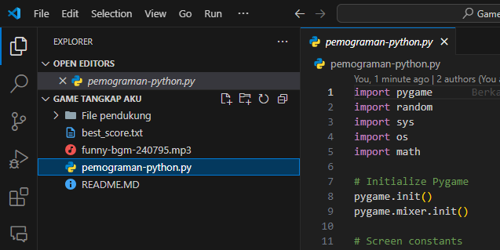
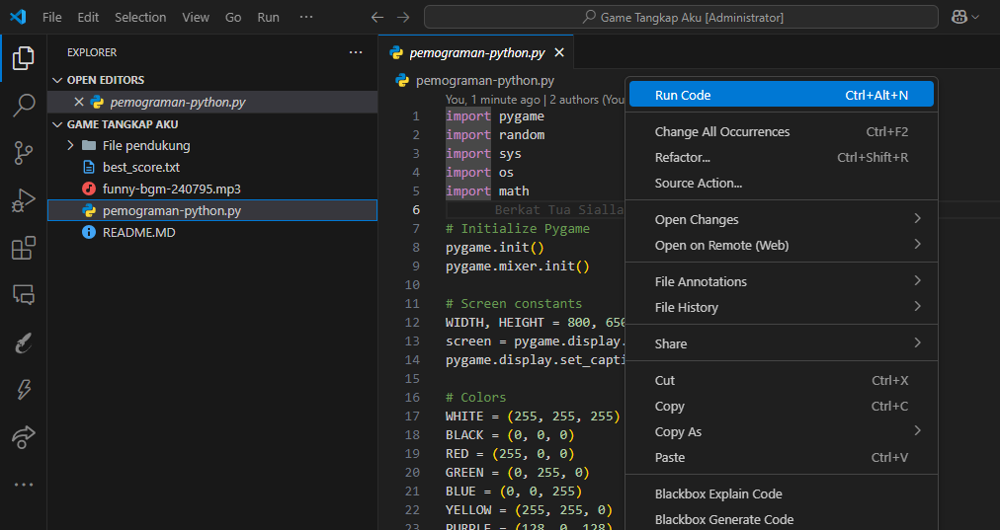
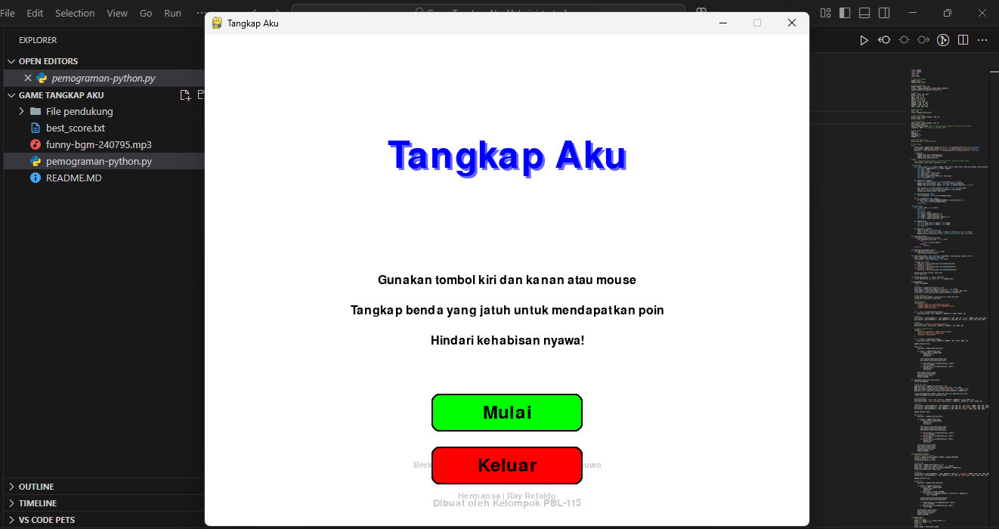
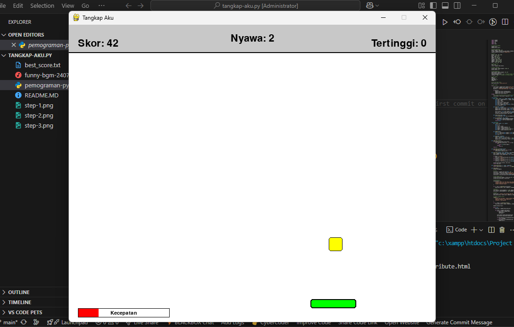

# Tangkap Aku

## Steps to Run the Game

1. Select the Python file (pemograman-python.py).  
   

2. Right-click to open the menu and choose "Run".  
   

3. Click to start the game.  
   

4. In Game
   

Tangkap Aku is a fun and challenging Python game built with Pygame where the player controls a bar to catch falling objects. The goal is to catch as many objects as possible without losing all your lives. The game features increasing difficulty, sound effects, particle animations, and a simple but engaging gameplay loop.

## How to Play

- Use the left and right arrow keys or the mouse to move the player bar horizontally.
- Catch the falling objects to earn points.
- Avoid missing objects; you start with 5 lives.
- The game speed gradually increases, making it more challenging.
- The game ends when you lose all your lives.
- You can pause the game by pressing the `ESC` or `P` key.
- After game over, you can retry, return to the main menu, or exit.

## Controls

- **Left Arrow**: Move player bar left
- **Right Arrow**: Move player bar right
- **Mouse**: Move player bar horizontally
- **ESC or P**: Pause/Resume the game
- **Mouse Click**: Select menu buttons

## Features

- Smooth and responsive controls with keyboard and mouse support.
- Increasing difficulty with faster falling objects over time.
- Particle effects when catching or missing objects.
- Sound effects for catching and missing objects (if sound files are available).
- Background music loop (if music file is available).
- Main menu, pause screen, and game over screen with interactive buttons.
- High score tracking saved locally in a file.

## Installation

1. Make sure you have Python 3 installed on your system.
2. Install Pygame library if you don't have it:
   ```
   pip install pygame
   ```
3. Download or clone the game source code.
4. Place the sound files (`catch.wav`, `miss.wav`, `funny-bgm-240795.mp3`) in the same directory as the game script if you want sound effects and music.

## Running the Game

Run the game script using Python:

```
python pemograman-python.py
```

Enjoy playing Tangkap Aku!

## Credits

Created by Kelompok PBL-115:

- Berkat Tua Siallagan
- Adhyca Hafeez Wibowo
- Nayla Nur Nabila
- Suci Aqila Nst
- Hermansa
- Ray Refaldo

---
